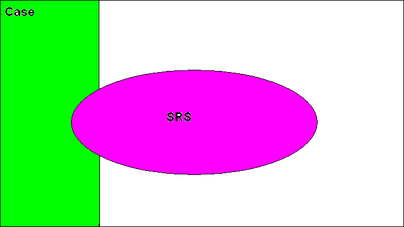

## Introduction

This project is part of the Research Experiences for Undergraduates (REU) program in China. All of the team members of this project were undergraduates in statistics at [Wuhan University](https://en.whu.edu.cn/). The faculty that supervised this project is [Dr.Jieli Ding](http://maths.whu.edu.cn/info/1415/11672.htm).

In this project, we

- conducted statistical simulations with case-cohort sampling (Case + SRS) design and compare its efficiency against simple random sampling (SRS) under cox proportional harzard model. :computer: [R code](main_simulation.r)

- applied the methodology to the data from the third and fourth clinical trials of the US National Wilms Tumor Study Group (NWTSG). :computer: [R code](data_analysis.r)

## References (in Chinese :cn:)

- [Technical report](presentations/final_report.pdf)

- [Presentation slides](presentations/slides.pdf)
